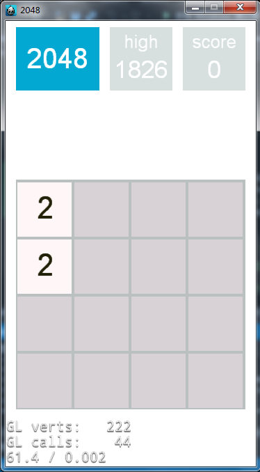
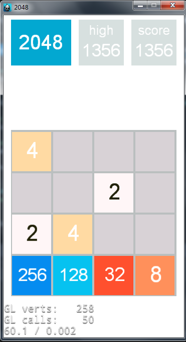
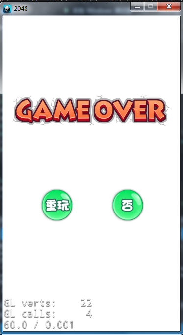

# 2048
使用Cococs2d-x3.8&amp;C++开发的2048小游戏

>* 简介：使用Cococs2d-x3.8&amp;C++开发的2048小游戏  

>* 开发环境：  
Cococs2d-x3.8&C++  

>* 游戏预览  

  

>* 游戏下载  
[Win版下载](https://yunpan.cn/c6IUbhv8ZSyyr)访问密码 768b  
[Android版下载](https://yunpan.cn/c6IU4UA7sbJu8)访问密码 807c
